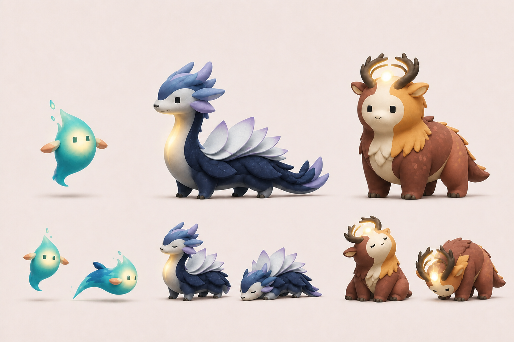
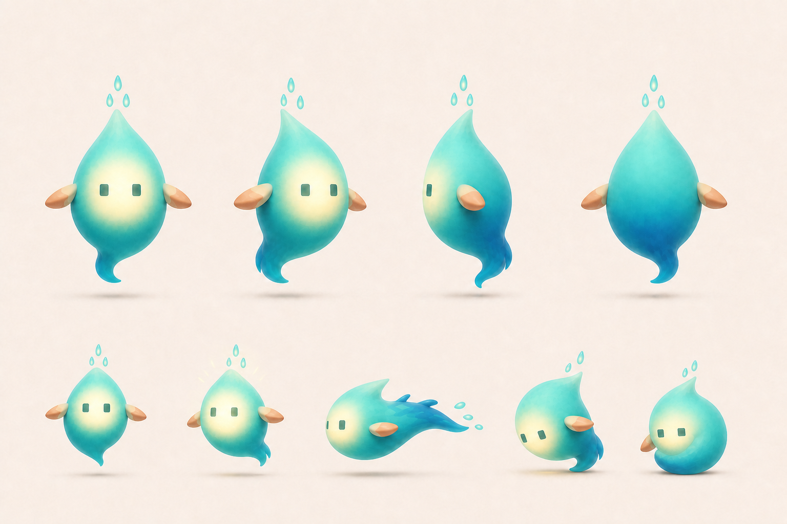
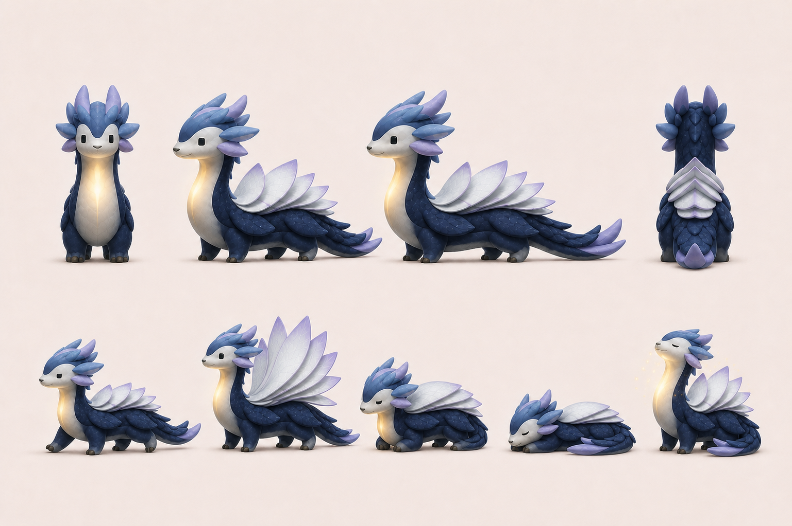
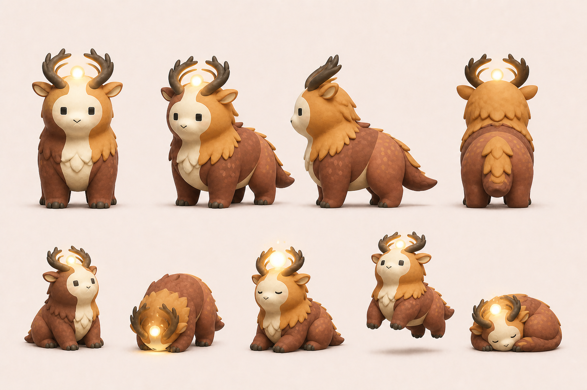

# 方心（CoupleSpace）品牌識別與角色宇宙

本文件記錄目前已選定的繁中品牌名稱、App icon、主吉祥物方心與 `Moment・此刻` 配角方向。概念圖用於鎖定設計語言，
不是可直接上架的最終素材；正式輸出仍須完成向量重建、小尺寸辨識、深色／tinted
版本、無障礙對比與實機測試。

## 品牌基準

- **繁中品牌名稱：** `方心`。
- **App Store 名稱：** `方心｜情侶的私密日常`。
- **App Store 副標題：** `聊天、回憶與共享約定`。
- **內部專案名稱：** `CoupleSpace` 暫時保留於 Xcode、Bundle ID、程式識別與歷史文件；技術改名須另開實作，不由品牌決策直接觸發。
- **產品承諾：** 再忙，也能每天留一點位置給彼此。
- **延伸句：** 把零碎日常，慢慢變成我們的生活。
- **氣質比例：** 80% 溫柔成熟的共同生活，20% 可愛療癒感。
- **視覺核心：** 兩段各自完整的生活，在交會處形成一個溫暖、可信任的共同空間。
- **表達邊界：** 不把戀愛畫成績效、監控、幼兒化角色扮演或性別化配對。

## 對外內容人格

`80% 溫柔成熟、20% 可愛療癒` 是 App 核心體驗與品牌價值的基準，不要求所有
社群內容維持相同的安靜程度。短影音、迷因與活動企劃可以提高幽默、荒謬與視覺張力，
但不得改變方心對低壓連結、雙方對等、私密信任與共同生活的承諾。

- **App 內：** 保持安靜、可靠、不打擾，讓照片、文字與共同回憶成為主角。
- **商店與官網：** 先清楚傳達產品價值與信任，再用適量幽默降低理解門檻。
- **社群與活動：** 可以用真實的情侶日常、反差、冷面笑點與荒謬情境爭取注意；
  笑點應能自然回到「忙碌中仍為彼此留下位置」，而不是只追逐無關流量。
- **不變底線：** 不以焦慮、猜疑、羞辱、查勤、性別對立、關係比較或未經雙方同意的
  私密內容作為娛樂與獲客素材。

App 與主吉祥物共用「方心」名稱，藉由方形輪廓與「放心」借音統一品牌記憶。需要區分時，
產品稱為「方心 App」，角色稱為「方心角色」或暱稱「方方」。方心角色對外可採
「一本正經地面對荒謬情侶日常」的冷面角色：看見反差但不站隊、陪伴但
不評判。可以讓情境失控，不讓方心變成吵鬧的裁判、戀愛教練或逼迫互動的角色。

## App icon 方向

目前選定「兩段生活重疊成一扇光窗」：深色與暖色的兩個錯位圓角矩形互相交疊，
交會處形成一個明亮的小方窗。兩個形體各自保持完整，不以吞沒、包覆或依附表達關係。

此構圖應傳達：

- 兩個人各有自己的生活與空間。
- 交會的部分屬於兩人共同創造，而不是其中一方所有。
- 中央光窗代表值得留下的 `Moment・此刻`，也代表私密、溫暖與安心。
- 圖形在小尺寸下仍能以「兩個錯位色塊＋一個明亮交會區」被辨識。

探索參考圖中只採用左側 App icon；中間與右側方向均未選用：

### 明確避免

- 愛心、婚戒、聊天泡泡或一男一女等直接戀愛符號。
- 左右鏡像的肉色有機曲線、中央直向橢圓開口或可能產生性器官聯想的構圖。
- 讓產品看起來像另一個聊天 App、婚禮 App、育兒 App 或戀愛遊戲。
- 過度粉紅、糖果色、厚重光澤與高比例可愛裝飾。

## 吉祥物：方心

- **中文名稱：** 方心。
- **日常暱稱：** 方方。
- **命名概念：** 「方」來自方形身體與中央光窗；「方心」借音「放心」，連結 CoupleSpace
  對私密、安全與低壓互動的承諾。
- **國際名稱：** 尚未決定；不預設直接音譯，待中文角色與語氣穩定後另行研究。
- **角色定位：** 方心屬於這段關係，不代表任何一位伴侶，也不是裁判、教練、寵物或虛擬小孩。

### 外形基準

- 主體是略高於寬的圓角矩形，維持緊湊、可傾斜的輪廓。
- 深色後片與暖色前片錯位重疊，以不對稱曲線形成共同區域。
- 中央暖光方窗是臉，也是 Moment 被看見與保存的視覺核心。
- 只使用兩個小方眼，不使用固定嘴巴；情緒主要由眼睛、傾斜、手勢與亮度表達。
- 手掌與身體保持些微分離，雙腳短小，便於製作簡單的漂浮、靠近與跳起動畫。
- 頭頂的獨立小光格是「Moment 光點」，不是把手、天線、光環或配件。

### 個性

- 安靜、可靠、溫暖，會陪伴但不打擾。
- 對兩位伴侶保持中立，不代替任何一方說話或判斷關係狀態。
- 以亮起、靠近、輕微傾斜和短暫跳起表達回應。
- 不因使用者沒有打開 App、沒有回覆或沒有建立 Moment 而失落。

## Moment 配角宇宙

方心維持 CoupleSpace 的主吉祥物與品牌中心；`光點`、`時頁`、`約格` 是可分別承接
Moment、共同時間線與共同約定情境的三位配角。三者不是方心的換色版本，也不代表任一位
伴侶；角色擴充不得把 CoupleSpace 改造成虛擬寵物、養成遊戲或關係評分系統。

先前的[物種探索](assets/moment-sidekicks/concept-explorations/)與[配色探索](assets/moment-sidekicks/color-explorations/)
連同幾何造型概念一併保留為備選與設計追溯；除上述高區隔奇幻生物版本外，其他探索稿
不構成 accepted 角色外形、正式配色或待實作範圍。

### 光點

- **角色定位：** 感受到零碎日常中值得留下的一刻，對應 Moment 被發現、保存與亮起。
- **外形基準：** 無腳的漂浮光靈；水滴／火光狀身體、兩片小側鰭、流線尾部、兩個小方眼且無嘴，
  頭頂保留三顆分離光滴。
- **代表色：** 水藍綠與青色主體、深海藍尾端、淡桃側鰭、淡檸檬暖光核心。
- **動作語彙：** 安靜漂浮、發現後亮起、短距離前衝、靠近陪伴與蜷尾休息。

### 時頁

- **角色定位：** 承接共同時間線、回顧與被重新看見的記憶；珍惜過去但不以傷感催促互動。
- **外形基準：** 細長四足奇幻生物；長頸、低身、長尾與可開合的層疊頁片，維持安靜、從容的輪廓。
- **代表色：** 午夜靛藍主體、薰衣草與長春花色頭鰭／尾端、銀白頁片與暖金喉光。
- **動作語彙：** 慢走、頁片展開／收合、平靜伏臥與回憶亮起。

### 約格

- **角色定位：** 承接共同約定與即將一起發生的生活；可靠、準備充分，但不催促、不查勤。
- **外形基準：** 寬厚四足守護生物；短腳、層疊鬃毛與兩支朝中央交會的角，角間保留一顆懸浮暖光。
- **代表色：** 陶土橘與肉桂棕主體、赭金鬃毛、米白臉胸、深可可色角與暖琥珀光。
- **動作語彙：** 安穩等待、低頭聚光、雙角對齊、輕微跳起與蜷伏休息。

### 家族共同規則

- 方心可維持深靛紫／柔珊瑚主識別；三位配角各自使用高區隔代表色，不強制套用方心主色。
- 家族感由溫暖內光、小方眼、柔和材質、低壓動作與安靜可信任的角色人格建立，不依賴同色換皮。
- 配角不代表伴侶 A／B，不預設性別、個性、主動／被動位置或關係分工。
- 角色可以陪伴、回應與製造冷面反差，但不得哭泣、受傷、孤單等待、責備未互動或代替使用者判斷關係。
- 角色設定不新增主分頁、養成、收集、任務、連勝、貨幣或其他產品機制，也不成為 iPhone MVP 的完成依賴。

## 角色使用情境

方心可用於：

- 新手引導與尚未配對的中性說明。
- 空白狀態、Moment 儲存完成、共同約定建立完成等輕量回饋。
- 每週／每月回顧、紀念日與 Widget 的陪伴性畫面。
- 驗證後的數位心意、第一方免費貼圖與簡單動態效果。
- 隱私、安全、匯出與資料生命週期說明中的溫和引導，但不得淡化風險或取代清楚文字。

方心不得用於：

- 催促伴侶回覆、顯示等待時間、責備未互動或製造罪惡感。
- 關係分數、連勝、排名、任務壓力、回禮義務或任何績效化呈現。
- 哭泣、哀求、孤單等待、受傷或其他利用角色情緒逼迫使用者行動的畫面。
- 代替使用者自動表達心意、分析私密對話或宣告關係狀態。
- 在以照片、文字或共同回憶為主角的畫面中搶占主要視覺。

三位配角可在不遮蔽私人內容的前提下，分別用於：

- **光點：** Moment 建立／儲存完成、輕量回應、空白狀態與第一方貼圖。
- **時頁：** 共同時間線、每週／每月回顧、「一年前的今天」候選與回憶型貼圖。
- **約格：** 共同約定建立／更新完成、活動前後的溫和提示與約定情境貼圖。
- **共同用途：** Widget、商店／官網示意、社群內容與驗證後的第一方靜態／動態素材。

上述用途仍須遵守資料最小化與低壓原則；角色不得展示未經雙方同意的私密照片、文字或
Moment，也不得讓「未回覆」「約定取消」或「很久沒有新 Moment」成為角色受傷的原因。

## iPhone 啟動轉場

iPhone 冷啟動採用「光窗交會，方心醒來」：系統 Launch Screen 只顯示無文字的
燕麥暖白背景；進入 App 後，深靛紫與柔珊瑚兩個圓角形體靠近交會，中央暖光窗亮起，
再出現兩個小方眼、上浮的 Moment 光點與 `Moment` 品牌字樣，完整畫面短暫停留後淡入
App 內容。整段約 1.4 秒，不以動畫等待遠端資料或遮掩啟動失敗。

- 只在 iPhone cold launch 播放；由背景回到前景不重播。
- 除 `Moment` 品牌字樣外，不加入標語、音效、強烈閃光或高幅度彈跳。
- 開啟「減少動態效果」時，只保留約 0.15 秒的靜態暖白轉場。
- 動畫使用 SwiftUI 向量幾何；目前色值是品牌 token 定案前的暫定近似值。
- Launch Screen 與動畫背景必須使用同一色彩，避免系統畫面切換時閃白。

## 色彩與製作狀態

目前只確認色彩角色，尚未確認正式 token 與數值：

- **深靛紫：** 私密、穩定與其中一段生活。
- **柔珊瑚：** 溫度、回應與另一段生活。
- **燕麥暖白：** 呼吸感與非刺激性的背景。
- **暖琥珀光：** 交會區、Moment 光點與成功回饋。

正式定色前須檢查一般／深色／tinted icon、文字與圖形對比、Display P3／sRGB
輸出及 OLED 實機觀感。概念圖中的漸層、陰影、顆粒與色值不構成已接受的正式設計 token。
三位配角目前只接受各自的色彩家族與高區隔原則，不將概念圖中的精確色值升格為品牌 token。

## 下一批交付物

1. 以向量幾何重建 App icon，定義間距、圓角、交疊比例與安全區。
2. 產出標準、深色與 tinted icon，並驗證 1024、180、60、40、32 與 20 pt 尺寸。
3. 將方心重建成一致的正面、側面、背面與動作元件，不直接切用生成式概念圖。
4. 定義第一組基礎動作：安靜出現、Moment 亮起、靠近安慰、揮手、休息與開心跳起。
5. 依設定圖重建光點、時頁與約格的一致幾何、色彩 token、方向視圖、動作元件與小尺寸剪影。
6. 以繁中為 SSOT 建立四位角色語氣；英文、日文與簡中名稱及語氣另行驗證。
7. 完成既有品牌、角色名稱、商標與 App Store 圖示近似性查核後，才將名稱與圖形視為可公開發布資產。
