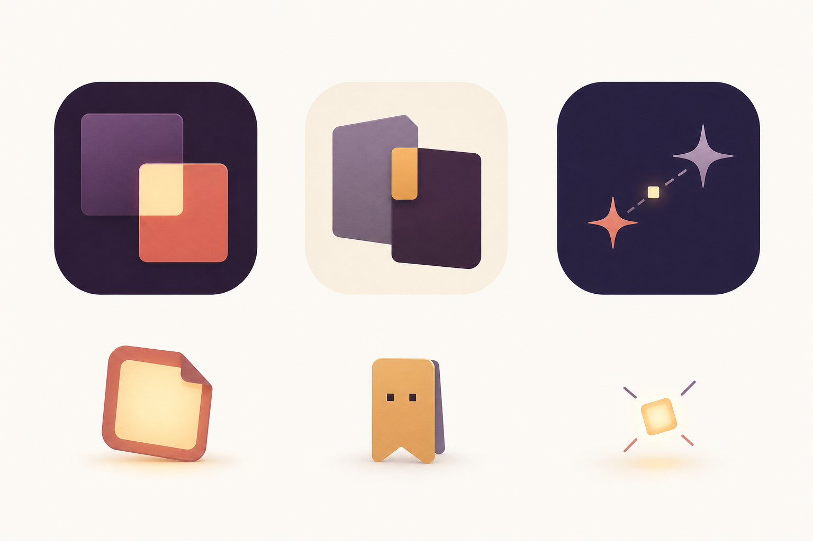
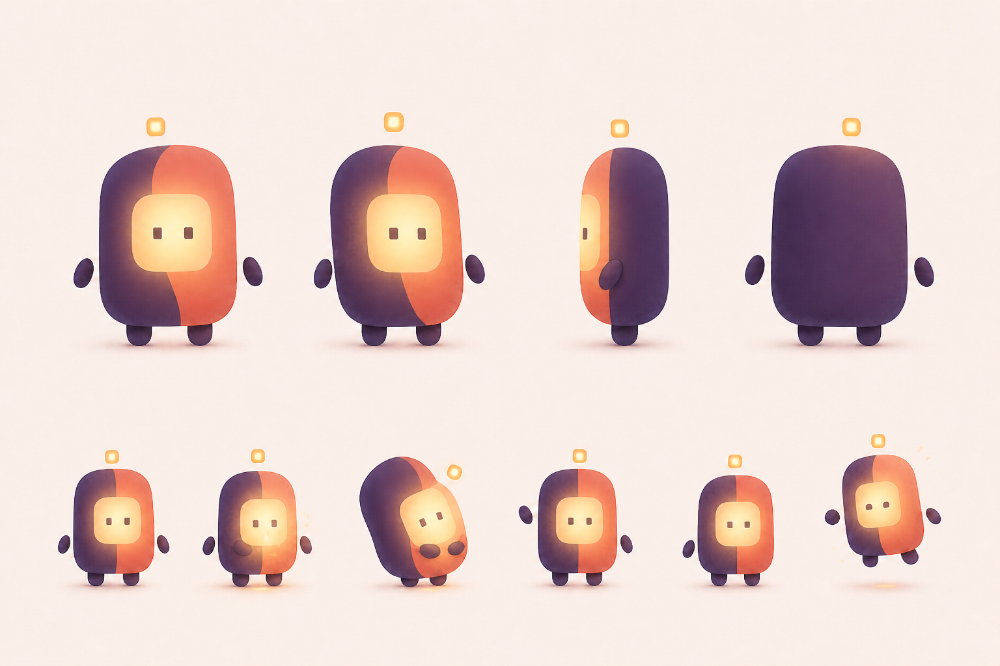

# CoupleSpace 品牌識別與方心吉祥物

本文件記錄目前已選定的 App icon 與中文吉祥物方向。概念圖用於鎖定設計語言，
不是可直接上架的最終素材；正式輸出仍須完成向量重建、小尺寸辨識、深色／tinted
版本、無障礙對比與實機測試。

## 品牌基準

- **產品承諾：** 再忙，也能每天留一點位置給彼此。
- **延伸句：** 把零碎日常，慢慢變成我們的生活。
- **氣質比例：** 80% 溫柔成熟的共同生活，20% 可愛療癒感。
- **視覺核心：** 兩段各自完整的生活，在交會處形成一個溫暖、可信任的共同空間。
- **表達邊界：** 不把戀愛畫成績效、監控、幼兒化角色扮演或性別化配對。

## 對外內容人格

`80% 溫柔成熟、20% 可愛療癒` 是 App 核心體驗與品牌價值的基準，不要求所有
社群內容維持相同的安靜程度。短影音、迷因與活動企劃可以提高幽默、荒謬與視覺張力，
但不得改變 CoupleSpace 對低壓連結、雙方對等、私密信任與共同生活的承諾。

- **App 內：** 保持安靜、可靠、不打擾，讓照片、文字與共同回憶成為主角。
- **商店與官網：** 先清楚傳達產品價值與信任，再用適量幽默降低理解門檻。
- **社群與活動：** 可以用真實的情侶日常、反差、冷面笑點與荒謬情境爭取注意；
  笑點應能自然回到「忙碌中仍為彼此留下位置」，而不是只追逐無關流量。
- **不變底線：** 不以焦慮、猜疑、羞辱、查勤、性別對立、關係比較或未經雙方同意的
  私密內容作為娛樂與獲客素材。

方心對外可採「一本正經地面對荒謬情侶日常」的冷面角色：看見反差但不站隊、陪伴但
不評判。可以讓情境失控，不讓方心變成吵鬧的裁判、戀愛教練或逼迫互動的角色。

## App icon 方向

目前選定「兩段生活重疊成一扇光窗」：深色與暖色的兩個錯位圓角矩形互相交疊，
交會處形成一個明亮的小方窗。兩個形體各自保持完整，不以吞沒、包覆或依附表達關係。

此構圖應傳達：

- 兩個人各有自己的生活與空間。
- 交會的部分屬於兩人共同創造，而不是其中一方所有。
- 中央光窗代表值得留下的 `Moment・此刻`，也代表私密、溫暖與安心。
- 圖形在小尺寸下仍能以「兩個錯位色塊＋一個明亮交會區」被辨識。

探索參考圖中只採用左側 App icon；中間與右側方向均未選用：

### 明確避免

- 愛心、婚戒、聊天泡泡或一男一女等直接戀愛符號。
- 左右鏡像的肉色有機曲線、中央直向橢圓開口或可能產生性器官聯想的構圖。
- 讓產品看起來像另一個聊天 App、婚禮 App、育兒 App 或戀愛遊戲。
- 過度粉紅、糖果色、厚重光澤與高比例可愛裝飾。

## 吉祥物：方心

- **中文名稱：** 方心。
- **日常暱稱：** 方方。
- **命名概念：** 「方」來自方形身體與中央光窗；「方心」借音「放心」，連結 CoupleSpace
  對私密、安全與低壓互動的承諾。
- **國際名稱：** 尚未決定；不預設直接音譯，待中文角色與語氣穩定後另行研究。
- **角色定位：** 方心屬於這段關係，不代表任何一位伴侶，也不是裁判、教練、寵物或虛擬小孩。

### 外形基準

- 主體是略高於寬的圓角矩形，維持緊湊、可傾斜的輪廓。
- 深色後片與暖色前片錯位重疊，以不對稱曲線形成共同區域。
- 中央暖光方窗是臉，也是 Moment 被看見與保存的視覺核心。
- 只使用兩個小方眼，不使用固定嘴巴；情緒主要由眼睛、傾斜、手勢與亮度表達。
- 手掌與身體保持些微分離，雙腳短小，便於製作簡單的漂浮、靠近與跳起動畫。
- 頭頂的獨立小光格是「Moment 光點」，不是把手、天線、光環或配件。

### 個性

- 安靜、可靠、溫暖，會陪伴但不打擾。
- 對兩位伴侶保持中立，不代替任何一方說話或判斷關係狀態。
- 以亮起、靠近、輕微傾斜和短暫跳起表達回應。
- 不因使用者沒有打開 App、沒有回覆或沒有建立 Moment 而失落。

## 使用情境

方心可用於：

- 新手引導與尚未配對的中性說明。
- 空白狀態、Moment 儲存完成、共同約定建立完成等輕量回饋。
- 每週／每月回顧、紀念日與 Widget 的陪伴性畫面。
- 驗證後的數位心意、第一方免費貼圖與簡單動態效果。
- 隱私、安全、匯出與資料生命週期說明中的溫和引導，但不得淡化風險或取代清楚文字。

方心不得用於：

- 催促伴侶回覆、顯示等待時間、責備未互動或製造罪惡感。
- 關係分數、連勝、排名、任務壓力、回禮義務或任何績效化呈現。
- 哭泣、哀求、孤單等待、受傷或其他利用角色情緒逼迫使用者行動的畫面。
- 代替使用者自動表達心意、分析私密對話或宣告關係狀態。
- 在以照片、文字或共同回憶為主角的畫面中搶占主要視覺。

## 色彩與製作狀態

目前只確認色彩角色，尚未確認正式 token 與數值：

- **深靛紫：** 私密、穩定與其中一段生活。
- **柔珊瑚：** 溫度、回應與另一段生活。
- **燕麥暖白：** 呼吸感與非刺激性的背景。
- **暖琥珀光：** 交會區、Moment 光點與成功回饋。

正式定色前須檢查一般／深色／tinted icon、文字與圖形對比、Display P3／sRGB
輸出及 OLED 實機觀感。概念圖中的漸層、陰影、顆粒與色值不構成已接受的正式設計 token。

## 下一批交付物

1. 以向量幾何重建 App icon，定義間距、圓角、交疊比例與安全區。
2. 產出標準、深色與 tinted icon，並驗證 1024、180、60、40、32 與 20 pt 尺寸。
3. 將方心重建成一致的正面、側面、背面與動作元件，不直接切用生成式概念圖。
4. 定義第一組基礎動作：安靜出現、Moment 亮起、靠近安慰、揮手、休息與開心跳起。
5. 以繁中為 SSOT 建立角色語氣；英文、日文與簡中名稱及語氣另行驗證。
6. 完成既有品牌、商標與 App Store 圖示近似性查核後，才將名稱與圖形視為可公開發布資產。
