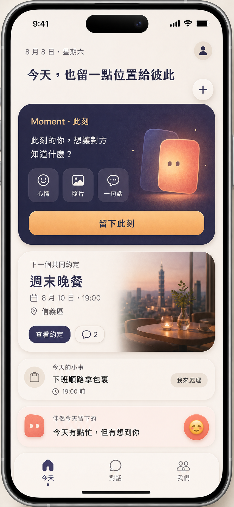
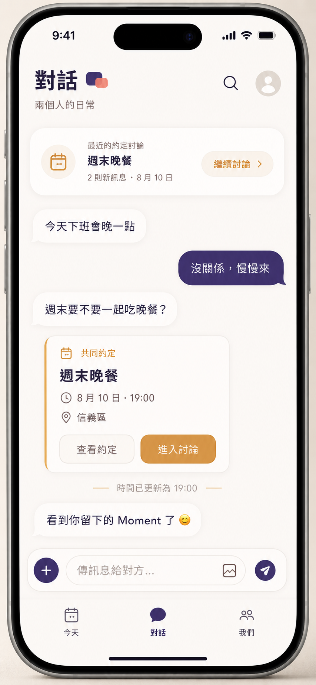
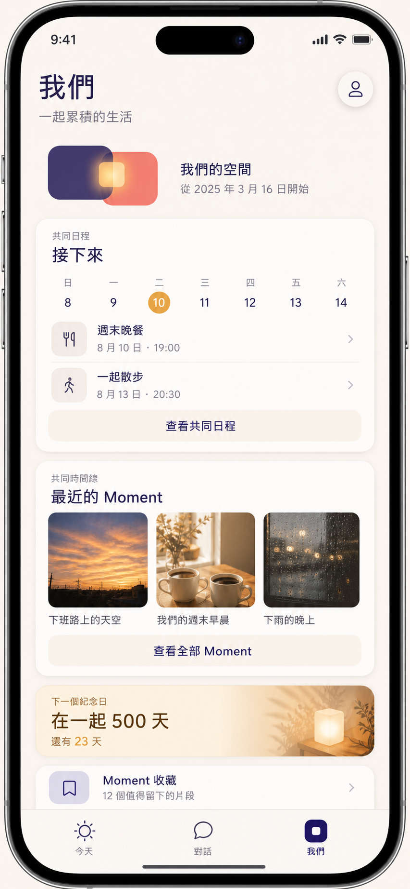

# iPhone 核心畫面與功能佈局概念

## 文件角色

本文件將已接受的 `今天／對話／我們` 三分頁、`現在的我們`、`Moment・此刻`、基本共同約定、主對話三向聯動與共同時間線，整理成可供產品原型、UI 設計及 SwiftUI 實作討論的高擬真畫面方向。

這三張圖片是 ImageGen 產生的概念參考，不是現有 App 截圖、正式設計 token、可直接切圖使用的產品資產或像素級驗收基準。圖片早於 PD-030，因此尚未畫出「現在的我們」狀態卡；產品範圍仍以 [核心體驗與資訊架構](../product/03-experience-and-information-architecture.md)、[iPhone 首版範圍](../product/04-iphone-mvp-scope.md)、[PD-027](../decisions/product-decisions.md#pd-027共同約定與主對話採三向聯動生活提醒先作低壓原型)及 [PD-030](../decisions/product-decisions.md#pd-030採自願性此刻狀態與分權名稱不提供在線監控或完整動態牆)為準；圖片與文字衝突時，以這些 SSOT 文件為準。

## 共同設計原則

- **Moment 優先：** App 預設進入「今天」，先讓使用者看見彼此與留下此刻，不先呈現待辦儀表板。
- **狀態由本人表達：** 「現在的我們」只顯示雙方主動設定且具期限的狀態，不以在線、最後上線、觀看紀錄或位置推測代替溝通。
- **三分頁不變：** 底部只保留「今天／對話／我們」；共同日程放在「我們」，不新增第四個日曆分頁。
- **同一共同約定，多處投影：** 今天摘要、主對話卡片、共同日程、詳情、專屬討論及通知引用同一筆資料，不各自建立副本。
- **低壓協調：** 不使用已讀時間、等待倒數、紅色逾期、連續催促、完成率、排名或伴侶比較。
- **自然中性：** 不預設伴侶性別、稱謂、審美或生活分工；人物位置以抽象頭像、共同光窗或內容本身表達。
- **視覺比例：** 80% 溫柔成熟的共同生活，20% 可愛療癒點綴；照片、文字與共同回憶是主角，方心不搶占主要內容。
- **色彩角色：** 燕麥暖白提供呼吸感，深靛紫表達私密與穩定，柔珊瑚表達溫度與回應，暖琥珀表達 Moment、交會與成功回饋。正式數值尚未定案。

## 1. 今天



### 畫面目的

「今天」負責當下連結。使用者先看見 Moment 建立入口與伴侶留下的內容，再看見近期共同安排；生活協調存在，但不主導首頁。

### 功能佈局

1. **日期、產品承諾與個人入口**
   - 顯示當日日期及一句低壓的情境文案。
   - 右上角提供個人／設定與 `＋` 快速建立入口。
   - `＋` 可通往 Moment、共同約定及照片；生活提醒只有在原型通過後才加入正式選項。
2. **現在的我們**
   - 以兩張精簡卡片顯示本人與伴侶主動設定、具期限的目前狀態，以及正確的顯示名稱或 owner-only 私人稱呼。
   - 每人只能修改自己的狀態；單純更新不預設通知、不進入共同時間線，也不顯示在線、最後上線或觀看紀錄。
   - 可明確選擇「也留成 Moment」，但之後修改狀態不得改寫已建立的 Moment。
3. **Moment 主卡片**
   - 是首頁面積、色彩對比與行動強度最高的區塊。
   - 提供心情、照片、一句話及主要「留下此刻」行動。
   - 方心只作為小型品牌回饋，不代替使用者表達情緒。
4. **下一個共同約定**
   - 顯示標題、日期、時間、可選地點，以及查看約定／進入討論的入口。
   - 卡片與「對話」「我們」中的同一筆共同約定同步；修改、取消與離線重試不得產生第二張獨立卡片。
   - 圖中的餐廳照片是情境示意，不代表 MVP 必須提供封面。只有使用者明確加入或討論中已有合適照片時才評估顯示縮圖。
5. **今天的小事**
   - 只示範一筆輕量生活提醒，使用中性「我來處理」而非「指派給伴侶」。
   - 這是 PD-027 的驗證後候選，不屬於目前 16 週 MVP；不因出現在概念圖中而視為已排入實作。
6. **伴侶今天留下的內容**
   - 讓畫面在日程與瑣事之後重新回到情感連結。
   - 可快速回應，但不顯示已讀、等待時間或是否正在輸入。

## 2. 對話



### 畫面目的

「對話」承接沒有主題限制的雙人聊天，同時讓共同約定留在正確脈絡。聊天仍是自由流動的日常，約定卡片只是結構化共同狀態，不把聊天室變成工單或專案頻道。

### 功能佈局

1. **近期約定討論入口**
   - 頂部只顯示最近有更新的少量約定討論，避免建立完整頻道列表。
   - 點擊直接進入該約定的專屬討論。
2. **一對一主對話**
   - 一般文字與照片維持熟悉的聊天節奏。
   - 不提供已讀標記、已讀時間、typing indicator 或等待多久。
   - 長按一般訊息可選擇收藏為 Moment，或進入建立共同約定的確認流程。
3. **共同約定卡片**
   - 顯示標題、時間、地點及「查看約定／進入討論」。
   - 從訊息建立時保留返回來源訊息的入口。
   - 日期、時間、地點或狀態更新時原卡片就地更新。
4. **重大狀態紀錄**
   - 只有日期／時間重大變更、取消等需要雙方注意的事件留下精簡系統紀錄。
   - 錯字與次要備註更新不新增訊息，避免主對話洗版。
5. **輸入列與 `＋`**
   - `＋` 支援直接建立共同約定，不要求先傳一般訊息。
   - 建立流程與長按訊息、「今天」及「我們」共用同一套表單、確認與去重規則。

### 三向聯動

```text
長按既有訊息進入確認
或輸入列「＋」直接建立
→ 建立同一筆共同約定
→ 主對話顯示卡片與必要狀態紀錄
→ 今天摘要、共同日程、詳情、討論與通知同步
```

系統不得只因訊息中出現「明天」「晚上七點」等語句自動建立行程；可以預填使用者選取的文字，但日期、時間與建立動作必須由使用者確認。

## 3. 我們



### 畫面目的

「我們」承接兩人共同累積的生活，包括共同日程、共同時間線、Moment 收藏、紀念日與兩人資料。它是完整查看與回顧入口，不是公開個人頁、群組首頁或關係績效報表。

### 功能佈局

1. **共同空間識別**
   - 使用兩個各自完整、錯位交疊的圓角形體，交會處形成共同光窗。
   - 不使用愛心、婚戒、一男一女或依附關係圖示。
2. **共同日程**
   - 首屏只呈現一週摘要及少量近期共同約定。
   - 「查看共同日程」再進入基本月曆、近期與過往列表。
   - 不在首版擴張成 Apple／Google Calendar 替代品，不處理重複行程、多組日曆或外部雙向同步。
3. **共同時間線**
   - 最近 Moment 使用照片與短標題形成共同生活的視覺重心。
   - 圖片不包含可識別人物只是概念稿選擇；正式產品使用雙方實際建立且仍有權存取的內容。
4. **紀念日**
   - 提供溫暖回顧與即將到來的提示，不使用焦慮式倒數或催促對方準備。
5. **Moment 收藏**
   - 讓使用者找回主動保存的對話、照片與共同片段。
   - 收藏數量是內容索引，不作為關係分數、成就或雙方比較。

## 跨畫面資訊對應

| 共同物件 | 今天 | 對話 | 我們 |
|---|---|---|---|
| Moment | 建立與查看伴侶今日內容 | 從訊息收藏、由 Moment 返回對話 | 共同時間線與收藏 |
| 共同約定 | 顯示下一筆摘要 | 主對話卡片、重大紀錄、專屬討論 | 月曆、近期與過往列表 |
| 生活提醒 | 驗證後只顯示少量近期項目 | 驗證後以輕量卡片處理，不建討論串 | 驗證後放入獨立輕量列表 |
| 共同時間線 | 不承擔完整瀏覽 | 提供相關內容返回入口 | 完整瀏覽、回顧與收藏 |

## 共用元件候選

這些名稱只描述可重用的視覺／行為責任，不預先要求特定 Swift 型別或檔案拆分：

- 核心三分頁容器與一致的底部導覽。
- 頁面標題、日期、個人／設定及快速建立入口。
- Moment 建立卡片、伴侶內容卡片與快速回應。
- 共同約定摘要卡片、對話內卡片、重大狀態列與專屬討論入口。
- 一週日程摘要、近期列表、過往列表與共同時間線卡片。
- 輕量生活提醒列；只有原型驗證後才進入正式元件規格。

實作時先以 G5、G7、G9、G10、G11 的垂直切片需要建立最小元件，不為尚未確認的第二種樣式預建複雜設計系統。

## 必備狀態

每個核心區塊在高擬真稿之外仍需補齊：

- 首次使用／尚未配對。
- 已配對但尚無 Moment、訊息或共同約定。
- 載入中、離線、傳送中、同步失敗與明確重試。
- 約定已修改、取消、結束及進入過往列表。
- 圖片不可用、權限失效或內容已依生命週期刪除。
- Dynamic Type、VoiceOver、減少動態效果、深色模式與高對比模式。

不能以 skeleton 永久遮住錯誤，也不能把本機待送內容呈現成已同步或已備份。

## 正式設計前仍需確認

- 正式色彩 token、一般／深色／tinted 模式及 OLED 實機觀感。
- 字體層級、Dynamic Type 換行、最小點擊區及繁中／簡中／英文／日文長度壓力。
- 三張概念圖中略有差異的底部圖示、卡片圓角、陰影與頁面邊距，必須收斂為同一設計系統。
- 共同約定無照片、有相關照片及照片不可用時的卡片樣式。
- 提醒預設值、取消後通知方式，以及活動後建立 Moment 的具體文案。
- 生活提醒原型的正式名稱、通過門檻與實作版本。

## 原型驗證重點

- 使用者能否在沒有教學下理解三個主分頁的分工。
- Moment 是否仍被感知為首頁核心，而不是被日程與生活提醒取代。
- 使用者能否理解主對話卡片、共同日程與專屬討論是同一筆共同約定。
- 長按訊息與輸入列 `＋` 是否服務不同習慣，又不造成重複建立。
- 重大狀態紀錄是否足夠清楚且不讓主對話洗版。
- 輕量生活提醒是否減少重複詢問，同時不造成被指派、被監控或伴侶績效感。

## 圖片來源與使用邊界

- 三張 v1 概念圖於 2026-08-08 使用內建 ImageGen 產生，並保存於 `docs/design/assets/iphone-core-screen-concepts/`。
- 圖片可用於內部產品討論、原型方向與實作對照，不直接作為 App UI bitmap、App Store 截圖或公開品牌資產。
- 正式畫面應使用 SwiftUI、SF Symbols 或經核准的向量／照片資產重建；不要從概念圖裁切按鈕、圖示、方心或文字。
- 生成圖中的字距、照片、裝置外框、圖示與色值可能不完全一致，必須經設計 token、無障礙及實機 QA 收斂。
