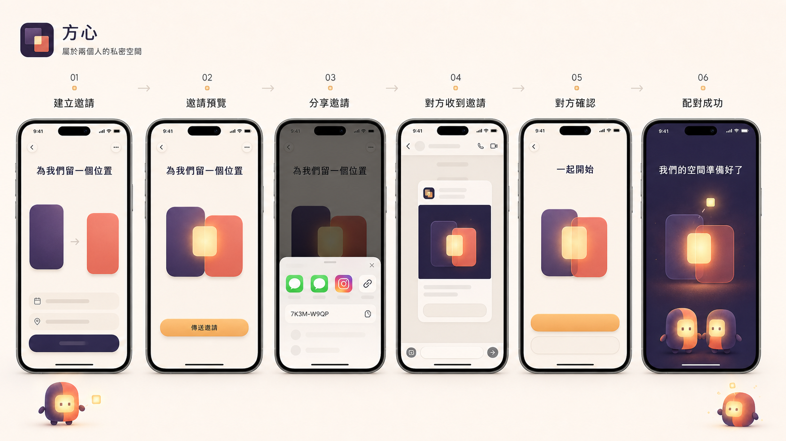

# 伴侶邀請、短配對碼與配對儀式

## 文件角色

本文件定義方心 iPhone 首版的伴侶邀請體驗、外部分享內容、短配對碼、接受確認與成功動畫。產品邊界以 [PD-041](../decisions/product-decisions.md#pd-041伴侶配對採邀請連結優先與短碼備援並以光窗交會完成低壓儀式) 為準；安全授權仍由伺服器、Supabase RPC 與 RLS 決定，任何畫面、連結預覽或本機狀態都不能自行授予 relationship membership。

這裡的「伴侶邀請」用來加入一段一對一 relationship，與 PD-040 的朋友推薦連結／碼分屬不同命名空間、入口與權限，不得混用。

## 體驗目標

- 受邀者不必辨識或輸入 36 字元 UUID；已安裝 App 時，主要路徑應是點擊一次邀請連結後確認。
- 無法直接開啟連結時，以 `XXXX-XXXX` 八位短配對碼完成，不把內部高強度 token 顯示成使用者任務。
- 邀請是受邀者第一次接觸方心品牌的時刻，應有溫柔成熟的畫面感，但不把加入關係變成情緒壓力、戀愛測驗或促銷兌換。
- 分享、安裝、登入、確認與配對失敗都應有可恢復路徑；視覺動畫不得掩蓋網路等待或伺服器錯誤。

## 端到端流程

### 1. 建立邀請

未配對使用者進入「為我們留一個位置」畫面。深靛紫與柔珊瑚兩個圓角形體保持分離，中央光窗尚未完全亮起。畫面以「傳送邀請」為主要行動，「顯示配對碼」為次要備援；不先用大段 token、倒數或技術狀態佔據主視覺。

邀請者可選擇三種固定語氣，預設為「自然」，不要求撰寫情書：

- **溫柔：**「我在方心留了一個只屬於我們的位置。想和你一起，把平常的小事慢慢留下來。」
- **自然：**「想跟你一起試試方心。把聊天裡容易沉下去的小事，留成我們的生活。」
- **冷面幽默：**「我們的聊天紀錄太會吃回憶了。我開了一個地方，準備把它們救回來。」

不得提供「如果你在乎我」「別讓我等太久」等施壓模板，也不顯示伴侶等待時間。

### 2. 傳送邀請

主要入口使用 iOS 系統分享表，分享一個可點擊的方心邀請 URL、使用者選擇的固定文案與一般品牌預覽；使用者可依裝置現有分享能力選擇 LINE、訊息、Instagram 私訊、AirDrop、複製連結或其他目的地。首版不為各社群建立彼此分歧的配對權限或訊息管線；若真實使用證據顯示 LINE 壓倒性主導，再評估額外的「用 LINE 傳送」捷徑。

外部分享內容包含：

- 可撤銷、具期限且單次使用的邀請 URL。
- 一句已選定的邀請文案。
- 不含私人內容的方心品牌預覽。
- 文字末尾的八位備援短碼，例如 `7K3M-W9QP`。

伴侶邀請的 Instagram 使用情境以私人訊息為主，不提供攜帶有效配對 token／短碼的公開限時動態素材。未來的公開方心推薦素材只屬朋友推薦或一般品牌分享，不得加入 relationship membership 憑證。

### 3. 開啟與安裝

- **已安裝 App：** Universal Link 開啟方心；若尚未登入，先完成 Apple 登入或 session 恢復，再由伺服器驗證邀請。
- **尚未安裝 App：** 連結開啟一般品牌落地頁，提供 App Store 入口與可複製的八位短碼。首版不把跨安裝 delayed deep link 視為已保證能力；安裝後仍可用短碼安全恢復。
- **連結無法使用：** 使用者可貼上短碼、完整邀請訊息或既有完整 token；輸入會忽略大小寫、空格與連字號，但不得從任意文字誤判另一組碼。

### 4. 接受確認

只有在有效邀請、登入身分與伺服器檢查通過後，App 才可顯示邀請者目前的顯示名稱及「為你留了一個位置」。確認頁只說明：這是兩個人的私人空間、完成後只有兩位有效成員能存取共同內容，以及接受不會公開資料。

主要行動為「一起開始」，次要行動為「現在不要」。拒絕、過期、邀請者已取消、任一方已有有效 relationship 或伺服器暫時不可用，都必須使用中性、可恢復且不洩漏邀請是否存在的訊息。

### 5. 配對成功

只有伺服器已接受 membership 且雙方讀回同一個 `2/2` active relationship 後，才播放成功動畫並進入正式三分頁。成功文案為「我們的空間準備好了」。

## 短配對碼安全契約

- 內部高熵 invitation token 繼續存在，不以 UUID 前幾碼直接充當短碼。
- 使用八位、排除 `0／O／1／I／L` 等易混淆字元的隨機碼，顯示為 `XXXX-XXXX`；格式化符號不屬於比較內容。
- 短碼與內部 token 同樣為一小時、單次使用；接受、拒絕、取消、過期或重建邀請後不可再次使用。
- 伺服器確保所有有效邀請短碼唯一；client 不自行判定 membership，也不以 relationship UUID 前綴作為邀請碼。
- 接受與拒絕只允許 authenticated user；初始防猜測 gate 為同一 authenticated user 十分鐘內最多五次無效嘗試，超過後暫時拒絕，且所有無效結果回傳相同外部訊息。
- 分析、一般 log、推播、客服畫面與 release record 不記錄完整 URL、內部 token 或短碼；必要診斷只保存結果類型與不可逆 fingerprint。
- 遷移期間保留既有尚未到期 token 的相容性，不因新增短碼使已分享的有效邀請突然失效。

## 畫面與動畫

此圖是 2026-08-15 以 ImageGen 產生的流程概念，用於表達六個階段、光線與畫面節奏，不是現有 App 截圖、正式設計 token、可直接切圖使用的資產或像素級驗收基準。圖中社群圖示、假資料與按鈕細節不構成已接受規格；最終成功畫面也不得以兩個方心角色代表伴侶 A／B，應以兩個抽象圓角形體交會，讓單一方心角色只在旁陪伴。

### 動態節奏

1. 建立邀請時，兩個形體分離，中央只有很弱的暖光。
2. 邀請預覽時，兩者靠近但不完全重疊；分享表是系統操作，不額外播放干擾動畫。
3. 接受確認時，中央光窗穩定亮起，但保持等待使用者明確確認。
4. 伺服器確認成功後，兩個形體在約 `0.8–1.2` 秒內交會，暖琥珀光亮起，一顆小型 Moment 光點上浮，短暫顯示成功文案後進入產品內容。
5. 開啟「減少動態效果」時，只使用約 `0.15` 秒的交會淡入與靜態暖光；動畫不延後伺服器請求，也不遮掩失敗。

避免愛心雨、彩帶、戒指、玫瑰、霓虹、強烈閃光、促銷卡、連勝或高幅度彈跳。儀式感來自留白、兩段生活交會、光線遞進與清楚文案，不來自裝飾數量。

## 實作分段

### G4A：立即短碼修正

先完成伺服器短碼、輸入正規化、現有 token 相容、限流、錯誤訊息及兩支真機的重複解除／重新配對。此切片不得等待 Universal Link、落地頁或完成動畫，目的是立即降低目前開發期頻繁重新配對的成本。

### G4B：TestFlight 前品牌化邀請

在 G15 TestFlight 候選版前完成 Universal Link／未安裝落地頁、系統分享表的 URL＋預覽、三種邀請語氣、接受確認與成功動畫。沒有穩定網域與 Associated Domains 證據時，不宣稱跨安裝自動恢復；短碼始終保留為備援。

## 驗收重點

- 新使用者不看說明即可從 LINE／訊息／Instagram 私訊中的連結進入確認；不支援的分享目的地仍能複製連結或短碼。
- 手動輸入八位碼、含連字號／空格／不同大小寫的碼、整段分享訊息與舊完整 token 均依相容規格處理。
- 錯碼、暴力嘗試、過期、拒絕、取消、已配對、同時建立兩份邀請及弱網重送不會錯配、洩漏或建立第三位成員。
- 兩支真實 iPhone 至少完成五輪「解除配對／清理到允許重新配對的狀態 → 建立新邀請 → 以連結或短碼接受 → 雙方讀回同一 relationship」，每輪舊短碼都不可再使用。
- Dynamic Type、VoiceOver、深色模式、高對比、四語長度與減少動態效果均有可驗證狀態。

